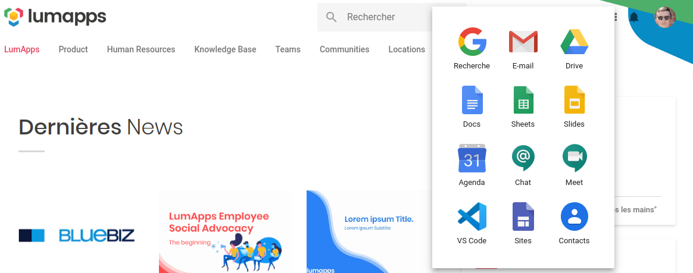

# Opening local applications from URLs


<div style="text-align: right">A link to open Visual Studio Code in the LumApps Bookmarked Apps dropdown</div>

## Introduction

A Uniform Resource Identifier ([URI](https://en.wikipedia.org/wiki/Uniform_Resource_Identifier)) is a string of characters that unambiguously identifies a particular resource.

A common (sub-)type of URI is the Uniform Resource Locator (URL) which can be used - *among other things* - to access a web page over the `http` protocol.

**i.e**: `https://www.lumapps.com` where `https` is the protocol and `www.lumapps.com` the network resource.

## URL schemes

In the previous example, the URL *scheme* is `https://`. But the use of URL is not limited to the web, and many more *schemes* can be defined.

Most modern softwares comes with pre-defined custom schemes; that allow you to interact with the software through URL.

[Microsoft Office](https://docs.microsoft.com/en-us/office/client-developer/office-uri-schemes)™ productivity applications for instance, allows you to open a document in *edit|view|from_template* modes using *ms-word, ms-powerpoint, ms-excel, ms-visio, ms-access, ms-project, ms-publisher, ms-spd or ms-infopath*.

## Defining custom schemes

If your favorite software does not provide a custom url scheme, you can define it yourself. In the following examples, we will be using Microsoft Visual Studio code, but the explanations should work for *any* software.

#### Disclamer: 
VSCode already provides `vscode` custom scheme, we will juste be defining a second one, `lumapps-vscode` for the sake of the example.

### Microsoft Windows

[credits](https://docs.microsoft.com/en-us/previous-versions/windows/internet-explorer/ie-developer/platform-apis/aa767914(v=vs.85))

1. Create a .reg file
```
Windows Registry Editor Version 5.00

[HKEY_CLASSES_ROOT\lumapps-vscode]
"URL Protocol"=""

[HKEY_CLASSES_ROOT\lumapps-vscode\shell]

[HKEY_CLASSES_ROOT\lumapps-vscode\shell\open]

[HKEY_CLASSES_ROOT\lumapps-vscode\shell\open\command]
@="\"C:\\Users\\Lumapps\\AppData\\Local\\Programs\\Microsoft VS Code\\Code.exe\" \"%1\""
```

**Notice** the string `lumapps-vscode`, it's your custom scheme. 

If needed, update the path to your executable file, and add/remove "%X" parameters.

2. Save the file
3. Double click on it
4. Accept the security prompts

[Using your custom scheme in html links](#Using-your-custom-scheme-in-html-links)


### Apple OsX

[credits](https://apple.stackexchange.com/a/253202)

1. Create the launcher

Using the built in script editor, create an AppleScript containing:

```AppleScript
<!-- Remove scheme from url (lumapps-vscode://)  
--   And Open VS Code with the file path.
-->
on open location this_URL
    set start_index to the length of "lumapps-vscode://" + 1
    set request to text start_index thru -1 of this_URL
    do shell script "open -a 'Visual Studio Code' request"
end open location
```

Save this file as an **Application**

2. Add the custom scheme to the launcher

    2.1. Locate the saved file on your disk

    2.2. Right click -> Show Package Contents

    2.3. Edit `Contents/info.plist`

At the end of the file, before the closing tags `</dict></plist>`, insert the following:

```xml
<key>CFBundleIdentifier</key>
<string>org.personal.lumappslink.indentifier</string>
<key>CFBundleURLTypes</key>
<array>
    <dict>
        <key>CFBundleURLName</key>
        <string>Open VS Code with from url</string>
        <key>CFBundleURLSchemes</key>
        <array>
            <string>lumapps-vscode</string>
        </array>
    </dict>
</array>
```

**Notice** the string `lumapps-vscode`, it's your custom scheme.

3. Register the custom scheme

    3.1. Save this file.

    3.2. Double click on it to execute it.

*Nothing should happen, but your custom protocal should have been registered.*

[Using your custom scheme in html links](#Using-your-custom-scheme-in-html-links)


### Linux (debian based)

[credits](https://askubuntu.com/a/919825)

1. Create a .desktop file
``` bash
# /usr/share/applications/vscode-handler.desktop
[Desktop Entry]
Name=LumApps VSCode URL Handler
GenericName=Text Editor
Comment=Handle URL Scheme lumapps-vscode://
Exec=/usr/share/handlers/vscode-handler %u
Terminal=false
Type=Application
MimeType=x-scheme-handler/lumapps-vscode;
Icon=code
Categories=TextEditor;Development;Utility;
Name[en_US]=LumApps VSCode URL Handler
```

**Notice** the string `lumapps-vscode`, it's your custom scheme.

2. Update the MIME-types database
``` bash
$ sudo update-desktop-database
```

3. Create the handler file

``` bash
# /usr/share/handlers/vscode-handler
#!/usr/bin/env bash
request="${1#*://}" # Remove scheme from url (lumapps-vscode://)
""" that's where the magic happens,
you can add some code to parse the url 
and interpret the parameters
(i.e. opening a file at a given line)
"""
code $request # launch vscode
```

4. Make it executable
``` bash
$ sudo chmod +x /usr/share/handlers/vscode-handler
```

5. Register the mime-type handler
``` bash
$ xdg-mime default /usr/share/applications/vscode-handler.desktop x-scheme-handler/lumapps-vscode
```

[Using your custom scheme in html links](#Using-your-custom-scheme-in-html-links)


## Using your custom scheme in html links

You can now create a link in LumApps using your custom URL Scheme:

Simple text link:
```html
<a href="lumapps-vscode://path/to/file.txt">Open file.txt in VS Code!</a>
```

With an image:
```html
<a href="lumapps-vscode://path/to/file.txt">
    
</a>
```

## Use cases

The use cases that can be implemented using custom url schemes are only limited by:
- The target software features (i.e. can it be invoked with the desired parameters)
- Your coding skills (i.e. are you abble to parse and interpret the url)

Your handler *could*:
- Simply open the application
- Open a file in the application
- Open a file in the application and go the a given line
- Create a new file in the application based on a given template
- etc.

## Security warning ⚠️

This is just a friendly reminder that allowing applications to be opened - *Even more so
with interpreted parameters* - by clicking on a link can present a risk for the safety of your information system.

The risk level depends on the program you expose, and the arguments you authorize.
