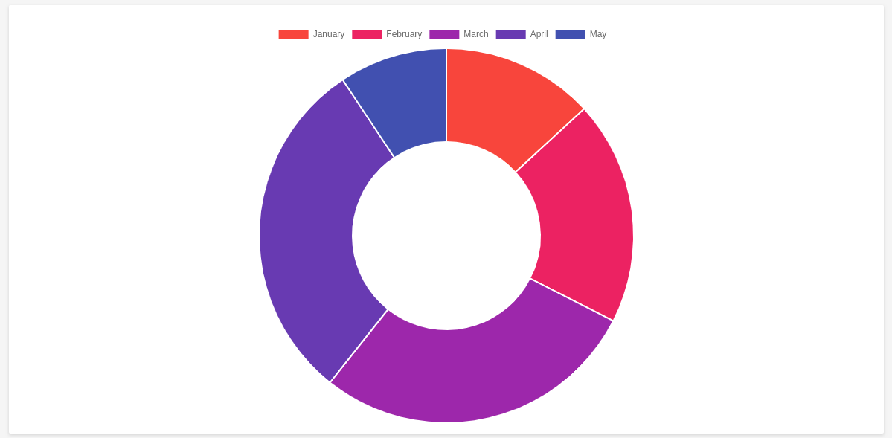
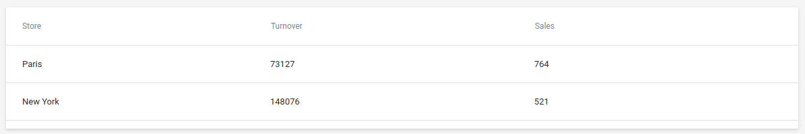
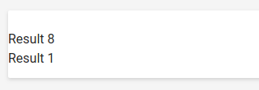

# Data Visuation Widget samples

Using the provided code, you will be able to quickly setup a project to serve data to LumApps Data Visualization Widget.

## Headers validation

The Data Visualization Widget uses a server side call made by LumApps to the provided address.

To protect your data from non authorized readers, the calls made by LumApps are all signed.

You must validate the call origin using the **shared secret** provided by LumApps support team and the following workflow:

The samples in this repository will help you implement this validation.

Once validated, you can answer the call with the data you want to display in the Data Visualization Widget.

## Pie chart
Returning

`Janvier,Février,Mars,Avril,Mai\n193,284,413,440,137`

will result in the following pie chart:

## Table
Returning

`Magasin,CA,Ventes\nMetz,73127,764\nRennes,148076,521`

will result in the following table:

## html
Returning

`<ul><li>Résultat 8</li><li>Résultat 1</li><ul>`

will be interpreted as:

